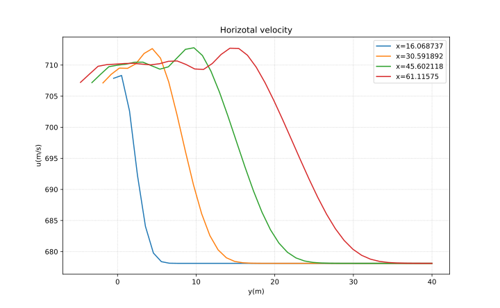
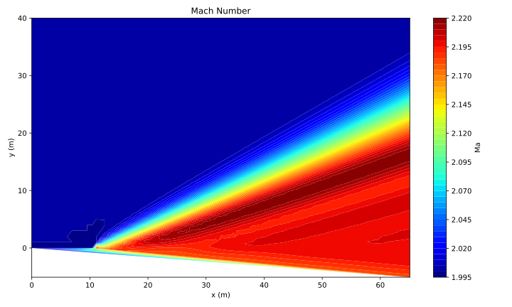
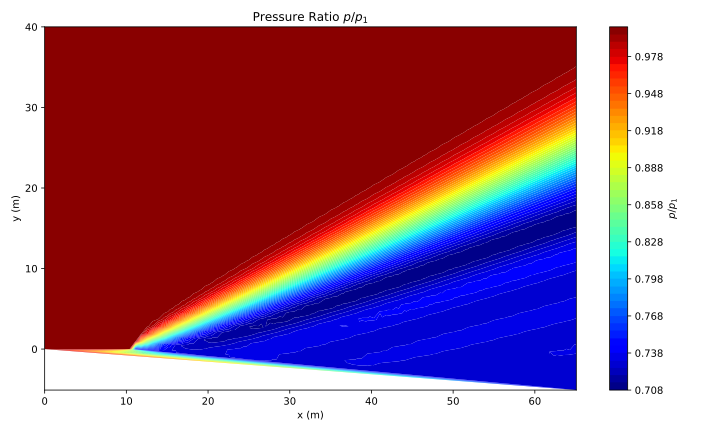

# Anderson's CFD Chap8(C++)

这个仓库是安德森《计算流体力学基础及其应用》第8章算例的C++实现，主程序为main.cpp。

考虑到MacCormack方法采用了两次一阶差分，实际上牺牲了流场上下边界的网格点，因此个人认为最后采用线性插值的方法求解上下边界的网格点更为合理。采用线性插值方法，在近壁面处得到的结果与作者提供的相近。（作者在书中给出近壁面速度约为706-708m/s）

## 计算结果展示

